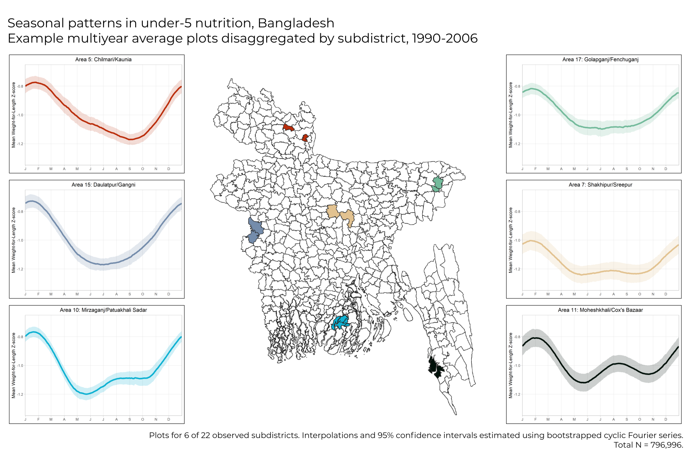

&nbsp;

&nbsp;

See below to learn about some of my current projects. You can download a copy of my CV [here](./files/cv.pdf).

&nbsp;

#### **Associations between fine particulate matter, extreme heat events, and congenital heart defects**  
I am working with environmental epidemiologist [Dr. Jeanette Stingone](https://www.mailman.columbia.edu/people/our-faculty/js5406) for my master's research in Columbia's [Department of Epidemiology](https://www.mailman.columbia.edu/academics/departments/epidemiology). 

We are assessing the effects of maternal exposure to air pollution (PM~2.5~) and extreme heat events on congenital heart defects in offspring. We are working with a nationwide group of researchers from the National Birth Defects Prevention Study ([NBDPS](https://www.cdc.gov/ncbddd/birthdefects/nbdps.html)), one of the largest studies of its kind in the US.

Ours is a follow-up study to published NBDPS research examining [extreme heat](https://pubmed.ncbi.nlm.nih.gov/29886237/), [air pollutants](https://pubmed.ncbi.nlm.nih.gov/24727555/), and [their interactions](https://www.ncbi.nlm.nih.gov/pmc/articles/PMC7004451/).

&nbsp;

#### **Timeseries analysis of climate variation and under-5 acute malnutrition in Bangladesh**
I am also working with Columbia's International Research Institute for Climate and Society ([IRI](https://iri.columbia.edu)), a part of the [Earth Institute](https://www.earth.columbia.edu/).

Specifically, I am working with [Dr. Hannah Nissan](http://www.lse.ac.uk/GranthamInstitute/profile/hannah-nissan/), [Dr. Robbie Parks](https://robbiemparks.github.io/), and [Dr. Shauna Downs](https://sph.rutgers.edu/concentrations/urban-global-public-health/faculty-member.php?id=92701) to assess associations between climate events and child anthropometry at seasonal and sub-seasonal scales, with a current focus on Bangladesh. Here is a [poster](./files/poster.pdf) of our preliminary findings, which won first prize at the 2020 NYC [Clinical Climate Change Conference](https://clinicalclimatechange.com/2020).

My research with IRI is funded by [ACToday](https://worldprojects.columbia.edu/content/actoday), Columbia University's first [World Project](https://worldprojects.columbia.edu/).

The figure below is from our preliminary research. It presents interpolated seasonal plots of child growth faltering in Bangladesh, which we found to differ by climatic region. Regional variability can be seen in both timing and magnitude of yearly undernutrition cycles.

&nbsp;
&nbsp;
