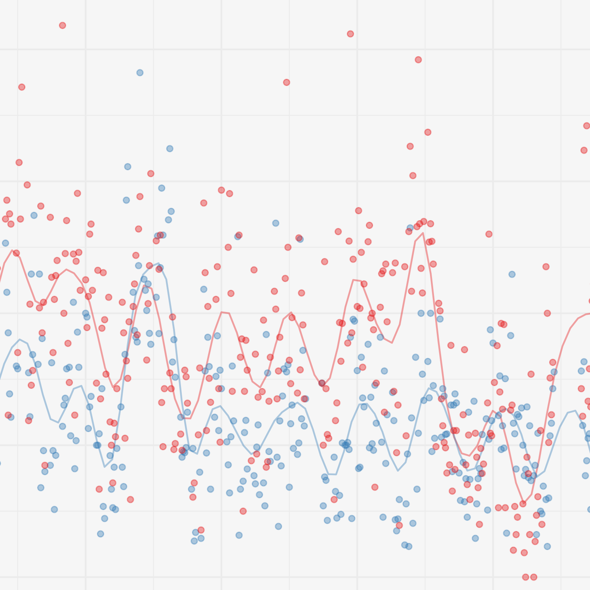
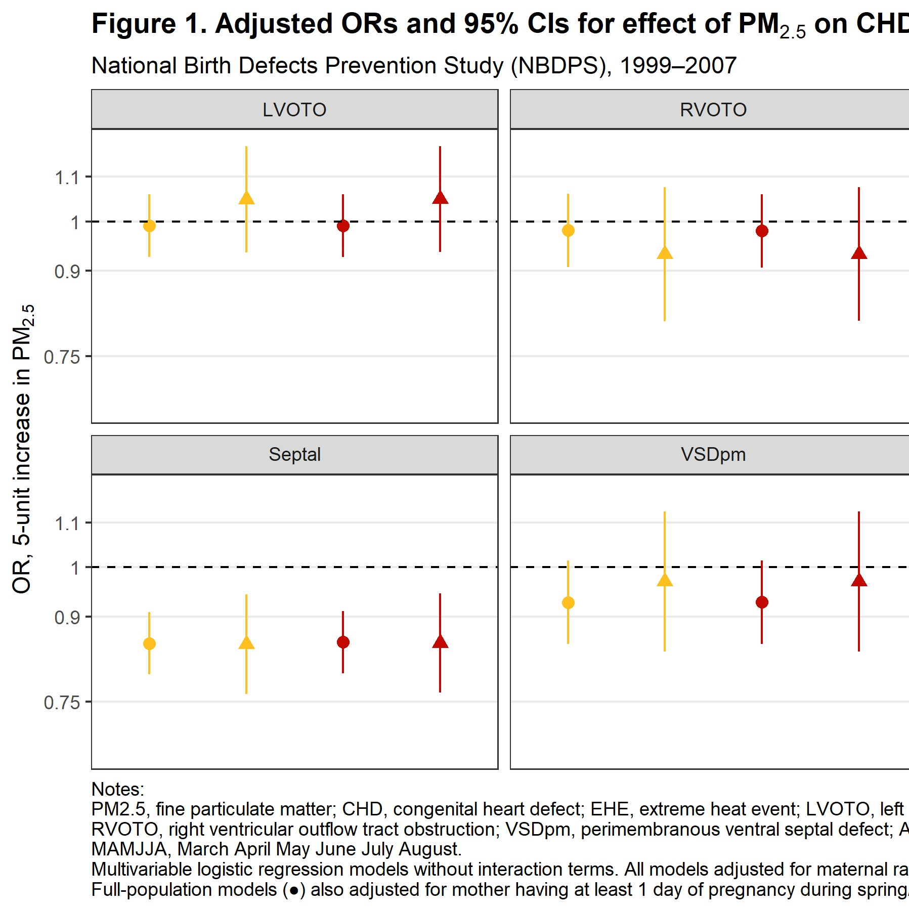
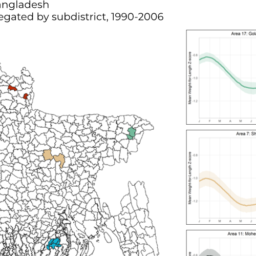
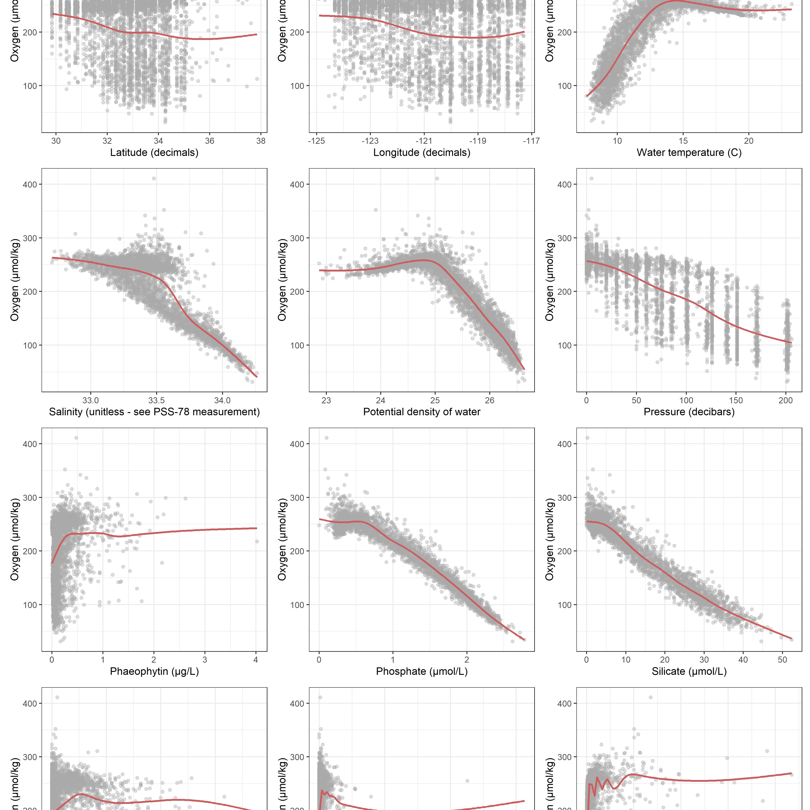
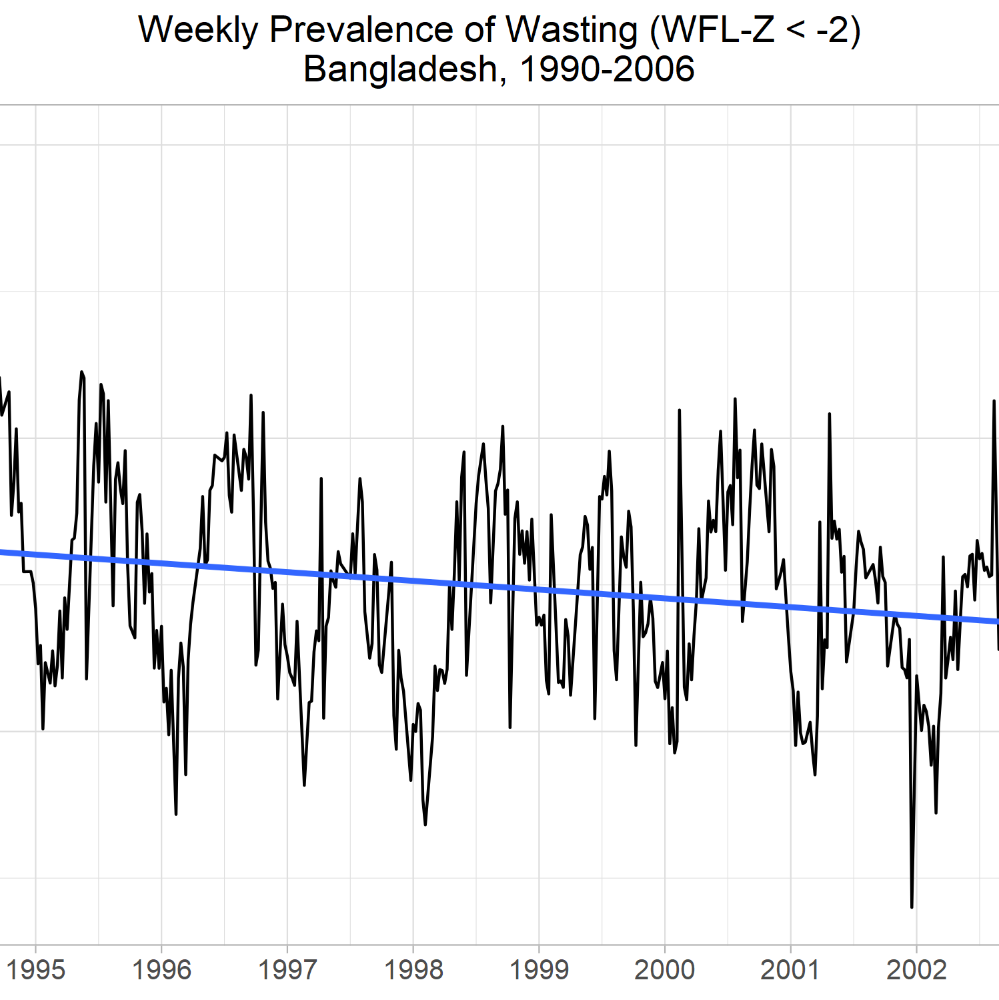
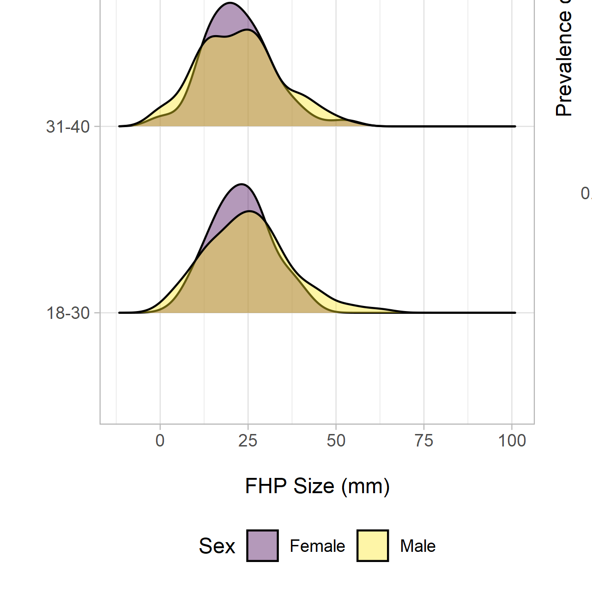
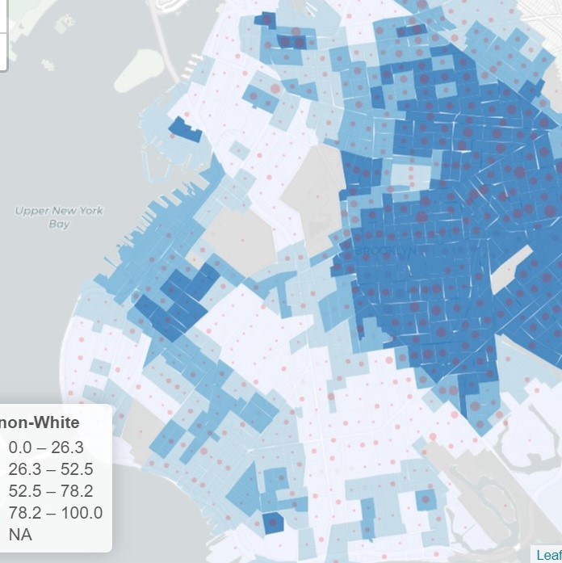
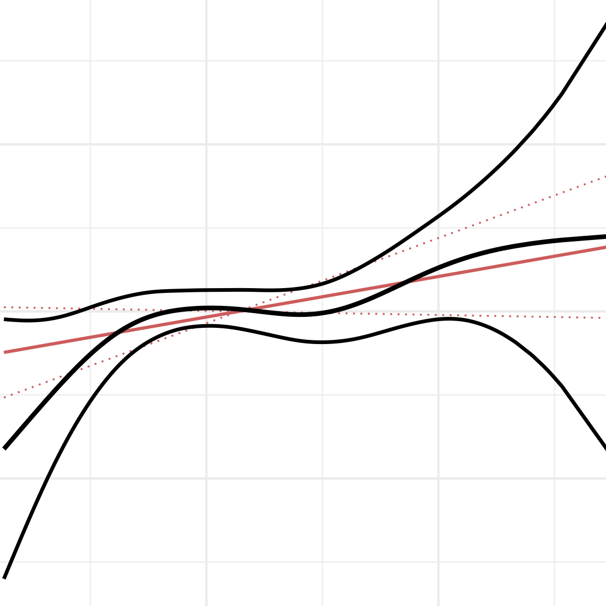
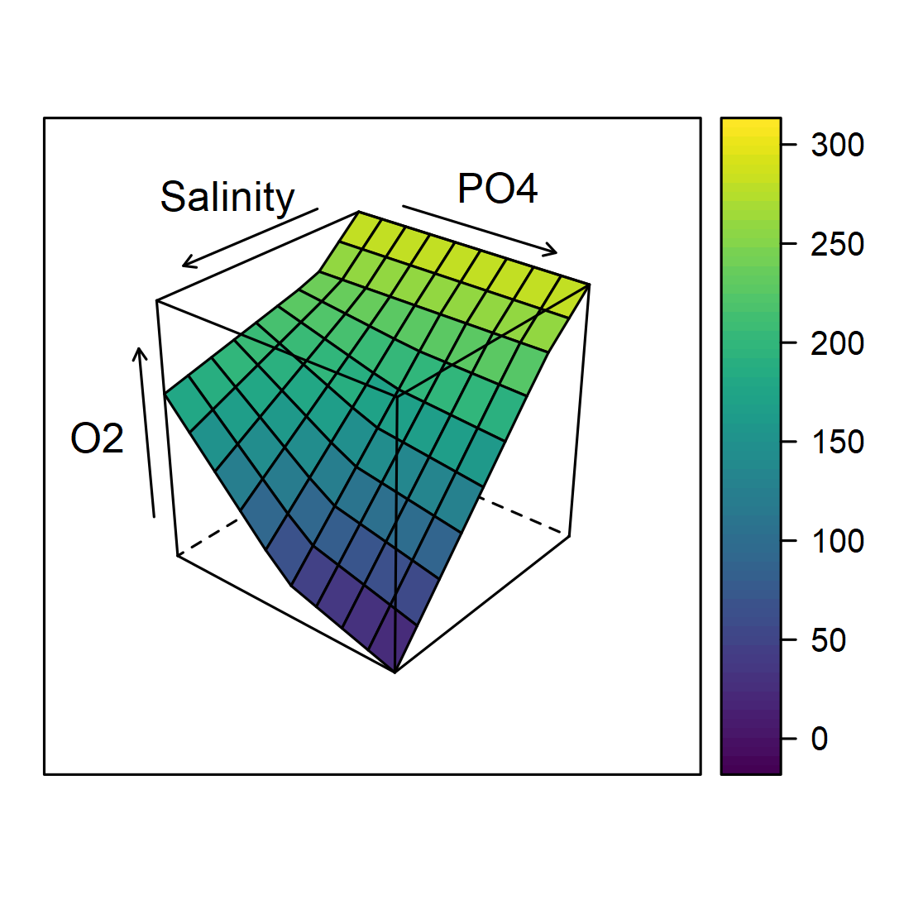

<!--  -->

&nbsp;

&nbsp;

#### **Data Visualization**

*Hover over each image for a brief description.*

<table class="gallery">
  <tr>
    <th></th>
    <th></th>
    <th></th>
  </tr>
  <tr>
    <th></th>
    <th></th>
    <th></th>
  </tr>
  <tr>
    <th></th>
    <th></th>
    <th></th>
  </tr>
</table>

&nbsp;

#### **Master's Thesis: Joint effects of prenatal exposure to fine particulate matter and extreme heat on congenital heart defects in offspring**

I completed my master's research with environmental epidemiologist [Dr. Jeanette Stingone](https://www.mailman.columbia.edu/people/our-faculty/js5406) and the National Birth Defects Prevention Study ([NBDPS](https://www.cdc.gov/ncbddd/birthdefects/nbdps.html)). As one of the largest studies of its kind globally, it comprises a nationwide cohort of researchers working to understand causes of birth defects.

For my master's research, I investigated the joint effects of maternal exposure to air pollution (in our study, PM~2.5~) and extreme heat events on congenital heart defects in offspring. I will continue this research with Dr. Stingone and the NBDPS team.

&nbsp;

#### **Research Poster: Climate variation and under-5 acute malnutrition in Bangladesh** **([PDF](./files/poster.pdf))**
Working with [Dr. Hannah Nissan](http://www.lse.ac.uk/GranthamInstitute/profile/hannah-nissan/), I performed preliminary analyses on links between climate events and child anthropometry at multiple timescales. I presented our [research](./files/poster.pdf) at the 2020 NYC [Clinical Climate Change Conference](https://clinicalclimatechange.com/2020).

We were awarded [first prize](./images/conference.png) for best research poster!

We are now carrying this research forward to a timeseries analysis of these associations, which will be submitted for publication Summer 2020.

&nbsp;

#### **Project: Evicted in Brooklyn** **([Site](https://simmwill.github.io/evictions))**
Evictions represent a major source of housing instability in the United States, especially in vulnerable communities. Eviction has now grown to what many consider epidemic proportions, with over 450,000 evictions filed in New York City between 2013 and 2015.

As a team of collaborators in Columbia's [Data Science I](https://p8105.com) course, we investigated what neighborhood-level factors could be used to predict yearly eviction rates in Brooklyn. We used data from Priceton's [Eviction Lab](https://evictionlab.org), the [US Census Database](https://factfinder.census.gov/faces/nav/jsf/pages/guided_search.xhtml), and [NYC Open Data](https://www1.nyc.gov/site/planning/data-maps/open-data/dwn-nynta.page). We created a [webpage](https://simmwill.github.io/evictions) to present our findings, complete with analysis details and a simple interactive [prediction tool](https://willsimmons.shinyapps.io/model_building/) I made in Shiny.

Out of ~50 student projects, instructors selected ours as one of the best. (Our reward? The [coveted cow hex sticker](https://p8105.com/images/p8105_stickers.png).)

&nbsp;

For info on my current research or to see my CV, click [here](https://simmwill.github.io/cv).

&nbsp;

More examples coming soon.

&nbsp;
&nbsp;