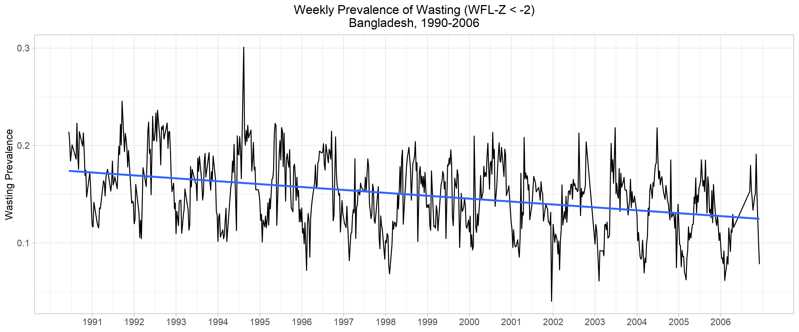

# This is Will's awesome website

You can learn about me [here](about.html).

# Let's add some links
I often use [Google](https://www.google.com) to do data science.

# Let's add an image
here's a neat figure I created:

